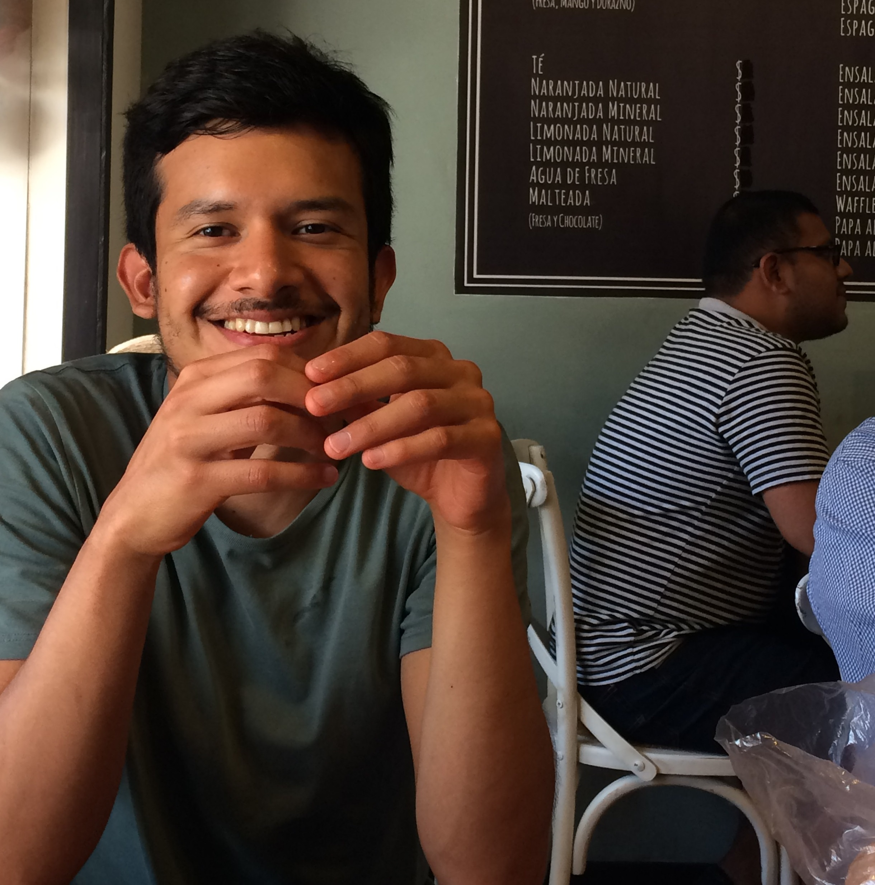
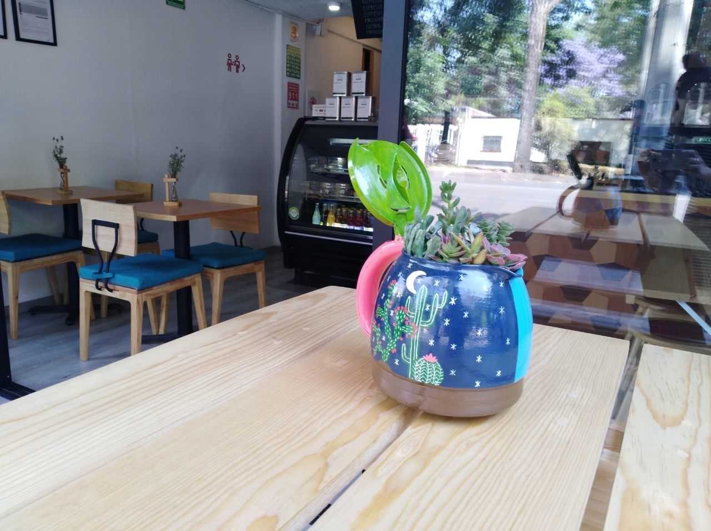
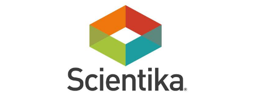

<!DOCTYPE HTML>
<!--
	Paradigm Shift by HTML5 UP
	html5up.net | @ajlkn
	Free for personal and commercial use under the CCA 3.0 license (html5up.net/license)
-->
<html>
	<head>
		<title>CV - Alejandro Comi Pretelín</title>
		<meta charset="utf-8" />
		<meta name="viewport" content="width=device-width, initial-scale=1, user-scalable=no" />
		<meta name="description" content="" />
		<meta name="keywords" content="" />
		<link rel="stylesheet" href="assets/css/main.css" />
	</head>
	<body class="is-preload">

		<!-- Wrapper -->
			

				<!-- Intro -->
					<section class="intro">
						<header>
							<h1>Alejandro Comi Pretelín</h1>
							
Empresario, Emprendedor, Desarrollador Web

							<ul class="actions">
								<li><a href="#first" class="arrow scrolly">Next</a></li>
							</ul>
						</header>
						

							
						

					</section>

				<!-- Section -->
					<section id="first">
						<header>
							<h2>Administración y Relaciones Internacionales (ITAM) (2009-2016)</h2>
						</header>
						

							
<strong>Visión Emprendedora.</strong> Decidí estudiar en el Instituto Tecnológico Autónomo de México (ITAM) una doble licenciatura en Administración y Relaciones Internacionales con el objetivo de constituir organizaciones con un gran impacto social que generen alianzas entre Organizaciones de la Sociedad
Civil (OSC), organismos públicos y empresas privadas con el fin de resolver distintas problemáticas sociales. 

							
						

					</section>
					<!-- Section -->
						<section>
							<header>
								<h2>El Café de los Sentidos, S. de R.L. de C.V.</h2>
							</header>
							

								
<strong>Co-Fundador y CEO.</strong> El Café de los Sentidos es una empresa social mexicana legalmente constituida reconocida por la Secretaría de Economía como una Empresa de Alto Impacto.   

Obtuve un 1er lugar en un concurso de Modelos de Negocio (Canvas Business Model) organizado en la 1ra Semana del Emprendedor. A partir de dicho premio, recibí un apoyo de $95,000 a fondo perdido de la Secretaría de Economía para incubar la empresa en Feher Consulting (consultora que tiene entre sus clientes a Cielito Querido Café, Sushi Itto y Fisher's entre otros).   

Administré todo el proceso de aplicación a una convocatoria Federal para recibir un apoyo adicional de $200,000 a fondo perdido de la Secretaría de Economía para el establecimiento de la primera cafetería de El Café de los Sentidos en Coyoacán.    

En 2015, co-fundé con Luz María Osuna (Presidenta del Foro de café de habla hispana más importante del mundo - La Cumbre Latinoamericana del Café) Grupo Coexme, A.C. organización que ha apoyado con más de 7 millones de pesos a más de 300 caficultores en Chiapas para ofrecer cafés de la más alta calidad.    

Desde 2013, año en el que co-fundé El Café de los Sentidos, ofrecemos la mejor calidad de café en México (conocida como café de especialidad). Desde entonces hemos ofrecido cafés tostados que llegan a tener un precio de $2,500/kg. En 2016, uno de nuestros cafés fue reconocido en el Premio Sabor como 1 de los 6 mejores cafés tostados de México. En 2017, ofrecimos una consultoría a Carlos García Campillo - caficultor poblano - para realizar un nuevo proceso de café que desconocía (Red Honey). Dicho café, obtuvo una Medalla de Oro en un concurso organizado por la Agence pour la Valorisation des Produits Agricoles en Francia.    

Desarrollé el proyecto integral de El Café de los Sentidos desde cero (Modelo de Negocio, Plan de Negocios, propuestas de inversión, estrategias comerciales, estrategia de responsabilidad social, sitio web con HTML5, CSS3 y Javascript, etc.).   

Empecé a desarrollar las campañas publicitarias (A/B Testing) con Facebook Ads recientemente en las cuales se ha invertido poco más de $40,000 y obtenido una utilidad de alrededor de $100,000.   

<strong>Otras actividades realizadas para la empresa: </strong>  
- Creación y desarrollo de menú de alimentos y bebidas  
- Desarrollo de nuevas líneas de negocio (comercialización de cacao tostado artesanalmente por El Café de los Sentidos). Ofrecemos el cacao orgánico que es considerado el mejor de México.  
- Programa 'Mi Asesor' desarrollado por le Banco Mundial, la Universidad de Stanford y la Secretaría de Economía. Realicé el proceso de selección de la convocatoria y fuimos escogidos para ser parte del programa.  
- Generación de alianzas clave con San Remo (una de las empresas de máquinas de espresso más importantes del mundo) y con Bunn (una de las empresas más importantes en la industria del café).  
- Consultor para Quantum Coffee. Desarrollé el Modelo de Negocio de dicho proyecto y la aplicación a la convocatoria de una incubadora de negocios respaldada por Google en la Universidad Nacional Autónoma de México (UNAM).  
- Me convertí en barista, tostador y catador de café con el objetivo de identificar y aprovechar los mejores granos de café.  
- Me he involucrado en todos los eslabones de la industria del café con el objetivo de entender integralmente cómo funcionan los distintos mercados de café en México y el mundo.  
- Desarrollé desde cero un taller 'Cómo Empezar tu Cafetería' que he impartido a más de 100 personas, también un 'Taller de Barismo y Arte Latte', un 'Taller de Catación/Degustación' y un 'Taller de Química del Café (Brew Bar)'.
- Desarrollo de eventos de café (Visitas guiadas a zonas productoras de café, catación de distintos cafés de especialidad)
  
<strong>Actualmente, con el apoyo de mi equipo de colaboración decidí tomar una pausa para continuar con mi crecimiento profesional en otras áreas de oportunidad.

</strong>
								<!-- Section -->
									<section>
										<header>
											<h3>Empresa de Alto Impacto reconocida por la Secretaría de Economía</h3>
											
<strong>Agosto de 2013 - Presente</strong>

										</header>
										

											

												
												
												
												
												
												
												
												 
												<video id="testimonio" width="320" height="240" controls>
												  <source src="images/gallery/thumbs/jessica.mp4" type="video/mp4">
												</video>
												<video id="testimonio" width="320" height="240" controls>
												  <source src="images/gallery/thumbs/jaime.mp4" type="video/mp4">
												</video>
												<video id="testimonio" width="320" height="240" controls>
												  <source src="images/gallery/thumbs/lourdes.mp4" type="video/mp4">
												</video>
												<video id="testimonio" width="320" height="240" controls>
												  <source src="images/gallery/thumbs/pamela.mp4" type="video/mp4">
												</video>
											

										

									</section>

					<section id="first">
						<header>
							<h2>Asistente | Scientika, A.C. (Mayo - Octubre 2015)</h2>
						</header>
						

							
<strong>Asistencia General.</strong> Desarrollo de propuestas para la reestructuración de Scientika, A.C.
Desarrollo del Business Plan de 'Munin' (excepto Análisis Financiero), proyecto desarrollado por Scientika para un cliente del norte de la República Mexicana.
Publicación de vacantes en la bolsa de trabajo del ITESM y de la IBERO en la Ciudad de México. 

								
							

						</section>
					<section id="first">
						<header>
							<h2>Director de Relaciones Externas (AIESEC-LIVE) (2012)</h2>
						</header>
						

							
<strong>Relaciones Públicas.</strong> Responsable de generar y dar seguimiento a relaciones con empresas y OSC. Investigar,
proponer e implementar programas de Responsabilidad Social Empresarial (Asado del Valle,
Sushi Itto, Education First, Toks). Organizar eventos con empresas y OSC. Constituir base de
datos de OSC para el proyecto.  

							
						

					</section>
					<section id="first">
						<header>
							<h2>Asistente | Fondos a la Vista  - Proyecto sobre Filantropía y Sociedad Civil del ITAM (2012)</h2>
						</header>
						

							
<strong>Donativos en México.</strong> Depurar y clasificar bases de datos del SAT. Aproximadamente 16,000 donativos de personas
								físicas y morales a Donatarias Autorizadas en el período 2008-2010 con Microsoft Excel.
								Investigar sobre Sociedad Civil, el sistema de donativos en México y generar una estructura organizacional en función de la clasificación de las Organizaciones sin Fines de Lucro de Estados Unidos. 

								
							

						</section>

				<!-- Section -->
					<section>
						<header>
							<h2>Feugiat consequat tempus ultrices</h2>
						</header>
						

							
<strong>Etiam tristique libero</strong> eu nibh porttitor amet fermentum. Nullam venenatis erat id vehicula ultrices sed ultricies condimentum.

							<ul class="feature-icons">
								<li class="icon solid fa-laptop">Consequat tempus</li>
								<li class="icon solid fa-bolt">Etiam adipiscing</li>
								<li class="icon solid fa-signal">Libero nullam</li>
								<li class="icon solid fa-cog">Blandit condimentum</li>
								<li class="icon solid fa-map-marker-alt">Lorem ipsum dolor</li>
								<li class="icon solid fa-code">Nibh amet venenatis</li>
							</ul>
							
Vehicula ultrices sed ultricies condimentum. Magna sed etiam consequat, et lorem adipiscing sed nulla. Volutpat nisl et tempus et dolor libero, feugiat magna tempus, sed et lorem adipiscing.

						

					</section>

					<section>
						<header>
							<h2>Duis sed adpiscing veroeros amet</h2>
						</header>
						

							
<strong>Proin tempus feugiat</strong> sed varius enim lorem ullamcorper dolore aliquam aenean ornare velit lacus, ac varius enim lorem ullamcorper dolore.

							<ul class="actions">
								<li><a href="#" class="button primary large">Get Started</a></li>
								<li><a href="#" class="button large">Learn More</a></li>
							</ul>
						

					</section>

				<!-- Elements -->
				<!--
					<section>
						<header>
							<h2>Elements</h2>
						</header>
						

							<section>
								<header>
									<h3>Text</h3>
								</header>
								

									
This is <b>bold</b> and this is <strong>strong</strong>. This is <i>italic</i> and this is <em>emphasized</em>.
									This is superscript text and this is subscript text.
									This is <u>underlined</u> and this is code: <code>for (;;) { ... }</code>. Finally, <a href="#">this is a link</a>.

									

									<h2>Heading Level 2</h2>
									<h3>Heading Level 3</h3>
									<h4>Heading Level 4</h4>
									<h5>Heading Level 5</h5>
									

									<h5>Blockquote</h5>
									<blockquote>Fringilla nisl. Donec accumsan interdum nisi, quis tincidunt felis sagittis eget tempus euismod. Vestibulum ante ipsum primis in faucibus vestibulum. Blandit adipiscing eu felis iaculis volutpat ac adipiscing accumsan faucibus. Vestibulum ante ipsum primis in faucibus lorem ipsum dolor sit amet nullam adipiscing eu felis.</blockquote>
									<h5>Preformatted</h5>
									<pre><code>i = 0;

while (!deck.isInOrder()) {
  print 'Iteration ' + i;
  deck.shuffle();
  i++;
}

print 'Sorted in ' + i + ' iterations.';</code></pre>
								

							</section>

							<section>
								<header>
									<h3>Lists</h3>
								</header>
								

									<h4>Unordered</h4>
									<ul>
										<li>Dolor pulvinar etiam.</li>
										<li>Sagittis adipiscing.</li>
										<li>Felis enim feugiat.</li>
									</ul>

									<h4>Alternate</h4>
									<ul class="alt">
										<li>Dolor pulvinar etiam.</li>
										<li>Sagittis adipiscing.</li>
										<li>Felis enim feugiat.</li>
									</ul>

									<h4>Ordered</h4>
									<ol>
										<li>Dolor pulvinar etiam.</li>
										<li>Etiam vel felis viverra.</li>
										<li>Felis enim feugiat.</li>
										<li>Dolor pulvinar etiam.</li>
										<li>Etiam vel felis lorem.</li>
										<li>Felis enim et feugiat.</li>
									</ol>
									<h4>Icons</h4>
									<ul class="icons">
										<li><a href="#" class="icon brands fa-twitter">Twitter</a></li>
										<li><a href="#" class="icon brands fa-facebook-f">Facebook</a></li>
										<li><a href="#" class="icon brands fa-instagram">Instagram</a></li>
										<li><a href="#" class="icon brands fa-github">Github</a></li>
									</ul>

									<h4>Actions</h4>
									<ul class="actions">
										<li><a href="#" class="button primary">Default</a></li>
										<li><a href="#" class="button">Default</a></li>
									</ul>
									<ul class="actions stacked">
										<li><a href="#" class="button primary">Default</a></li>
										<li><a href="#" class="button">Default</a></li>
									</ul>
								

							</section>

							<section>
								<header>
									<h3>Table</h3>
								</header>
								

									<h4>Default</h4>
									

										<table>
											<thead>
												<tr>
													<th>Name</th>
													<th>Description</th>
													<th>Price</th>
												</tr>
											</thead>
											<tbody>
												<tr>
													<td>Item One</td>
													<td>Ante turpis integer aliquet porttitor.</td>
													<td>29.99</td>
												</tr>
												<tr>
													<td>Item Two</td>
													<td>Vis ac commodo adipiscing arcu aliquet.</td>
													<td>19.99</td>
												</tr>
												<tr>
													<td>Item Three</td>
													<td> Morbi faucibus arcu accumsan lorem.</td>
													<td>29.99</td>
												</tr>
												<tr>
													<td>Item Four</td>
													<td>Vitae integer tempus condimentum.</td>
													<td>19.99</td>
												</tr>
												<tr>
													<td>Item Five</td>
													<td>Ante turpis integer aliquet porttitor.</td>
													<td>29.99</td>
												</tr>
											</tbody>
											<tfoot>
												<tr>
													<td colspan="2"></td>
													<td>100.00</td>
												</tr>
											</tfoot>
										</table>
									

									<h4>Alternate</h4>
									

										<table class="alt">
											<thead>
												<tr>
													<th>Name</th>
													<th>Description</th>
													<th>Price</th>
												</tr>
											</thead>
											<tbody>
												<tr>
													<td>Item One</td>
													<td>Ante turpis integer aliquet porttitor.</td>
													<td>29.99</td>
												</tr>
												<tr>
													<td>Item Two</td>
													<td>Vis ac commodo adipiscing arcu aliquet.</td>
													<td>19.99</td>
												</tr>
												<tr>
													<td>Item Three</td>
													<td> Morbi faucibus arcu accumsan lorem.</td>
													<td>29.99</td>
												</tr>
												<tr>
													<td>Item Four</td>
													<td>Vitae integer tempus condimentum.</td>
													<td>19.99</td>
												</tr>
												<tr>
													<td>Item Five</td>
													<td>Ante turpis integer aliquet porttitor.</td>
													<td>29.99</td>
												</tr>
											</tbody>
											<tfoot>
												<tr>
													<td colspan="2"></td>
													<td>100.00</td>
												</tr>
											</tfoot>
										</table>
									

								

							</section>

							<section>
								<header>
									<h3>Buttons</h3>
								</header>
								

									<ul class="actions">
										<li><a href="#" class="button primary">Primary</a></li>
										<li><a href="#" class="button">Default</a></li>
									</ul>
									<ul class="actions">
										<li><a href="#" class="button large">Large</a></li>
										<li><a href="#" class="button">Default</a></li>
										<li><a href="#" class="button small">Small</a></li>
									</ul>
									<ul class="actions">
										<li><a href="#" class="button primary icon solid fa-download">Icon</a></li>
										<li><a href="#" class="button icon solid fa-download">Icon</a></li>
									</ul>
									<ul class="actions">
										<li>Disabled</li>
										<li>Disabled</li>
									</ul>
								

							</section>

							<section>
								<header>
									<h3>Form</h3>
								</header>
								

									<form method="post" action="#">
										

											

												<label for="demo-name">Name</label>
												<input type="text" name="demo-name" id="demo-name" value="" placeholder="Jane Doe" />
											

											

												<label for="demo-email">Email</label>
												<input type="email" name="demo-email" id="demo-email" value="" placeholder="jane@untitled.tld" />
											

											

												<label for="demo-category">Category</label>
												<select name="demo-category" id="demo-category">
													<option value="">-</option>
													<option value="1">Manufacturing</option>
													<option value="1">Shipping</option>
													<option value="1">Administration</option>
													<option value="1">Human Resources</option>
												</select>
											

											

												<input type="radio" id="demo-priority-low" name="demo-priority" checked>
												<label for="demo-priority-low">Low</label>
											

											

												<input type="radio" id="demo-priority-high" name="demo-priority">
												<label for="demo-priority-high">High</label>
											

											

												<input type="checkbox" id="demo-copy" name="demo-copy">
												<label for="demo-copy">Email me a copy</label>
											

											

												<input type="checkbox" id="demo-human" name="demo-human" checked>
												<label for="demo-human">Not a robot</label>
											

											

												<label for="demo-message">Message</label>
												<textarea name="demo-message" id="demo-message" placeholder="Enter your message" rows="6"></textarea>
											

										

										<ul class="actions">
											<li><input type="submit" value="Send Message" class="primary" /></li>
											<li><input type="reset" value="Reset" /></li>
										</ul>
									</form>
								

							</section>

						

					</section>
				-->

				<!-- Section -->
					<section>
						<header>
							<h2>Get in touch</h2>
						</header>
						

							
<strong>Auctor commodo</strong> interdum et malesuada fames ac ante ipsum primis in faucibus. Pellentesque venenatis dolor imperdiet dolor mattis sagittis.

							<form>
								

									

										<input type="text" name="name" id="name" placeholder="Name" />
									

									

										<input type="email" name="email" id="email" placeholder="Email" />
									

									

										<textarea name="message" id="message" placeholder="Message" rows="7"></textarea>
									

								

								<ul class="actions">
									<li><input type="submit" value="Send Message" class="button primary" /></li>
								</ul>
							</form>
						

						<footer>
							<ul class="items">
								<li>
									<h3>Email</h3>
									<a href="#">information@untitled.ext</a>
								</li>
								<li>
									<h3>Phone</h3>
									<a href="#">(000) 000-0000</a>
								</li>
								<li>
									<h3>Address</h3>
									1234 Somewhere Road, Nashville, TN 00000
								</li>
								<li>
									<h3>Elsewhere</h3>
									<ul class="icons">
										<li><a href="#" class="icon brands fa-twitter">Twitter</a></li>
										<li><a href="#" class="icon brands fa-facebook-f">Facebook</a></li>
										<li><a href="#" class="icon brands fa-instagram">Instagram</a></li>
										<li><a href="#" class="icon brands fa-linkedin-in">LinkedIn</a></li>
										<li><a href="#" class="icon brands fa-github">GitHub</a></li>
										<li><a href="#" class="icon brands fa-codepen">Codepen</a></li>
									</ul>
								</li>
							</ul>
						</footer>
					</section>

				<!-- Copyright -->
					
&copy; Untitled. All rights reserved. Design: <a href="https://html5up.net">HTML5 UP</a>.

			

		<!-- Scripts -->
			
			
			
			
			
			

	</body>
</html>
